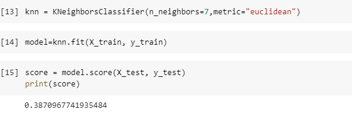

# **Integrantes.**
# Jonathan Andres Vanegas Herrera 
# Karen Yulieth Rodríguez Baez
# Fabian David Merentes Fraile
# Alinson Bridgeth Correa Zuniga
# Juan Sebastián Muñoz Riveros del chat. 
# **Resumen.**
En este proyecto mediante el uso de un ejemplo de machine learning se realizó el análisis de datos y ejecución de técnicas para un modelo que realiza la evaluación de docentes, esto con el fin de determinar a partir de una serie de datos en qué nivel se encuentra dicha calificación (bajo, medio, alto).
# **Introducción**

Por medio de este proyecto se quiere dar evidencia de la importancia de la incorporación de nuevas tecnologías dentro de las organizaciones, dentro del cual una de las mayores muestras de innovación ha sido la inteligencia artificial la cual se ha usado en diversas áreas de conocimiento , la cual por medio de una serie de datos que funcionan como entrenamiento para estos modelos y además se organizan para facilitar el aprendizaje automático. 

**ANTECEDENTES.**

Se ha podido evidenciar que los modelos de machine learning han sido aplicados en diversas áreas de conocimiento dentro de las cuales podemos resaltar algunos ejemplos como lo son: los antivirus, la genética, la biología, los vehículos y la educación.  Los cuales tienen como objetivo la inclusión de métodos de análisis de información para aprender a partir de los datos con los que se entrenan dichos modelos.

Es así como se ejecutan modelos tales como el reconocimiento de imágenes los cuales se encargan de hallar patrones particulares, clasificarlos y agruparlos para obtener una respuesta a la incógnita presentada mediante el conjunto de datos, así mismo los patrones de predicción de datos se encargan de analizar grandes conjuntos de información con el fin de desarrollar modelos de machine learning que permiten intentar predecir con cierta precisión los valores que se obtendrán a partir de dicho conjunto.

**Metodología** 

Se definen las actividades a realizar para el cumplimiento del objetivo final.

1. Levantar los requerimientos iniciales
- Hacer una comparación de los diferentes modelos de machine learning basados en lenguaje supervisado y no supervisado.
- Diseñar un modelo de machine learning través de Google colab para la calificación de docentes.
- Entrenar a partir de la dataset el machine learning.
- Investigar y analizar que estructura se manejara para la realización del proyecto.
1. Realizar una consulta de como se debe entrenar cada uno de los algoritmos.
- Investigar cada uno de los algoritmos que nos pueden ayudar a enfocar este proyecto en machine learning.
- Investigar como es el desarrollo y entrenamiento de cada algoritmo para así usar el más adecuado.
- Realizar una prueba con un modelo inicial de un algoritmo que se adecuado para el proyecto.
1. Realizar el api.
- Desarrollar el código que va a leer el modelo y procede a hacer la predicción con los datos entrenados.
- Realizar las pruebas necesarias y así comprobar el correcto funcionamiento del machine learning.

**Resultados y Comparaciones.**

**Como se realizó el modelo**

El desarrollo del modelo fue por medio de Google colab la cual es una herramienta que permite comparar variedad de modelos y probar su porcentaje de aciertos con mucha facilidad. Para ello se tomaron 4 algoritmos diferentes, pertenecientes a modelos supervisados – clasificación.

Una vez se realizaron estas comparaciones se determinó que el algoritmo con mejor porcentaje de acierto fue decisión tree. A continuación, se puede apreciar las diferentes ejecuciones de algoritmo con sus respectivas tasas de aciertos.

La tasa de aciertos no es más alta debido a que la base de datos que se usa solo cuenta con 150 datos, esto hace que el algoritmo no sea tan asertivo.

**Creación del entorno**

Para la creación del entorno en un servidor local con “**Conda**”, el entrono va a tener instalado Python y se instalar las dependencias necesarias entre ellas streamlit la cual permite el desarrollo mucho mas sencillo de machine learning gracias a sus librerías.

**Desarrollo del API**

El API esta desarrollada con visula studio code implementado el lenguaje de api, esta tiene la función de leer el modelo preentrenado, cargarlo y así obteniendo una predicción con la lectura de los valores que son ingresados por el usuario.

**Paso a paso de cómo funciona.**

1. Iniciamos el servidor local en “Conda” con los siguientes comandos
- conda activate ApiCrop.
- streamlit run app.py

1. ingresamos los atributos o datos requeridos en la interfaz.

1. Por último, presionamos el botón de predicción y así obtendremos la precisión de calificación docente (1- bajo, 2- medio, 3 – alto).

**Conclusión** 

Machine learning es una oportunidad de automatizara algunos procesos y disminuir la incertidumbre en algunas decisiones. Todo esto mejorando aun mas con el tiempo con los datos ingresados. Cabe aclarar que es fundamental detectar los problemas que pueden ser solucionado con esta herramienta y no llegar a invertir en una tecnología que pueda que no obtenga los resultados esperados. 

Referencias

[1]	Sistemas Inteligentes. (2021, 2 julio). Modelo de Machine Learning en Producción en Google Cloud usando Streamlit  | deploy | parte 1. YouTube. https://www.youtube.com/watch?v=vibDbEBnyV4.
[2]	https://www.studocu.com/co/document/fundacion-universitaria-compensar/sistemas-operativos/proyecto-organizado-1/35199240.+
[3]	Google Colaboratory. (s. f.). https://colab.research.google.com/?hl=es

